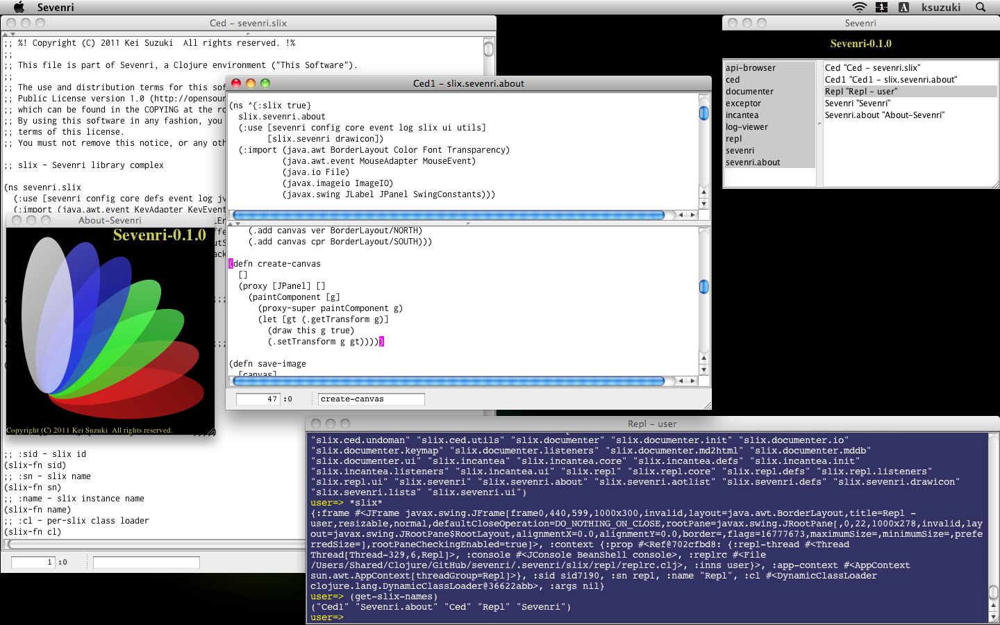
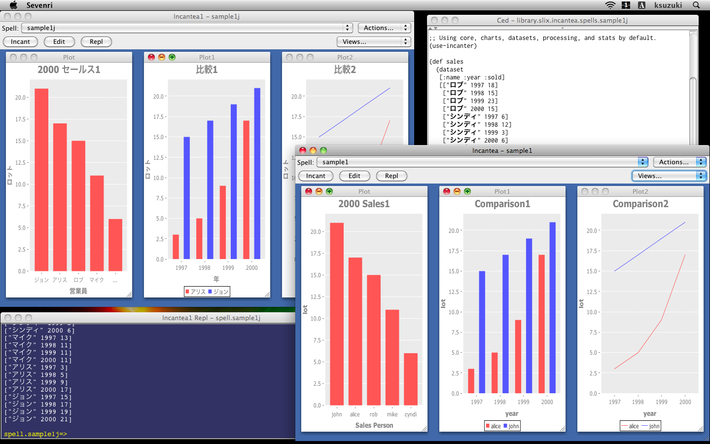

## 1 About Sevenri

Sevenri is a Swing-based, interactive Clojure environment written in Clojure. In Sevenri you can run application called *slix*. Sevenri comes with bunch of slixes, such as *REPL*, Clojure editor *Ced*, and Incanter front-end *Incantea*. With help of these slixes and powerful Clojure libraries you can learn and study Clojure, try out your ideas and run your projects, and even develop your own slixes, all in Clojure interactively.

## Current Status

This version of Sevenri is an early experimental, proof-of-concept version and runs on Mac OS X 10.6 only. Lots of features that are supposed to be in this kind of system are missing; menus, syntax highlighting and autocomplete in Ced, functions and slixes for file system and project management,  customization and refactoring tools, slix UI design and development facilities, etc. Small part is still written in Java.
