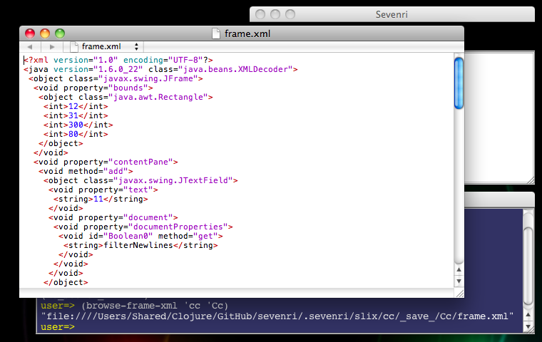
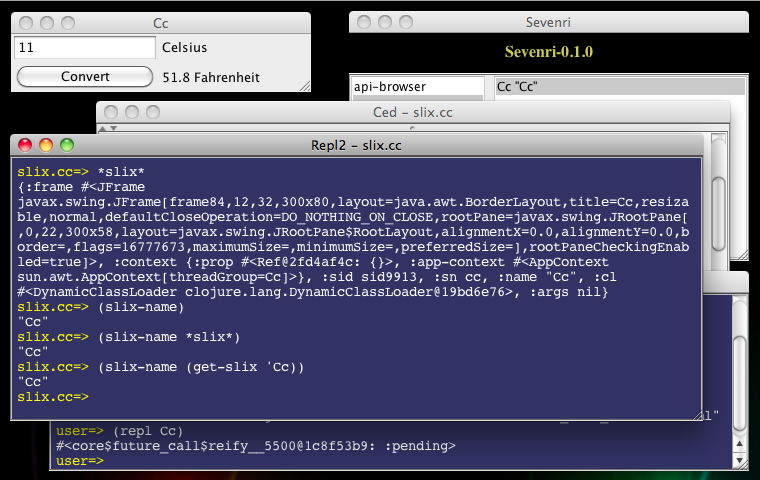

### 4 Developing Slix: A Quick Tour

This section describes the overview of developing slix. We create a slix called `cc`, a slix port of [a Celsius converter](http://clojure.org/jvm_hosted/).

#### 4.1 The `create-slix` Function

As explained in the section "2 Getting Started", a slix is an aggregate of libs providing definitions for particular Sevenri application. Each slix has a main lib whose namespace name consists of the prefix `"slix."` and the slix name. For example, the slix `sevenri` has the main lib `slix.sevenri`.

You create the main lib of the slix `cc` using the `create-slix` function. Given a slix name the `create-slix` function writes the main lib file filled with startup code. Open the REPL and call the function like this:

		(create-slix 'cc)

Notice that the Sevenri now shows the slix name `cc` in the left pane. You can open `cc` right away.

"Opening a slix" creates an instance of the slix. a slix instance is a map that represents a slix as executable entity and contains values required to execute the slix functions. Each slix instance has a unique name, normally generated by Sevenri automatically, and a JFrame that is used as the main window of the slix instance.

Double-click `cc` in the Sevenri to open it. An instance of `cc` is created and the main window opens. The instance name is displayed in the window title.

Before we move on and take a look at the main lib file, let's see some Sevenri functions that you use to control slix instance.

#### 4.2 Opening, Closing, Saving, and Deleting Slix Instance

You can open slix at the REPL using the `open-slix` function like this:

		(open-slix 'cc)

This does the same thing as you double-click `cc` in the Sevenri. The slix instance name is auto-generated by Sevenri using a naming convention in this format.

	*Slix-name-with-initial-capital-letter*[Optinal-number-starting-from-1]

For examle, the very first instance of `cc` will be named "Cc", the second instance is "Cc1", the third instance is "Cc2", and so on.

You can also open slix with instance name you like. Specify the instance name following a slix name like this:

		(open-slix 'cc "Celsius Converter")

<h4>Bear in mind, though, that Sevenri identifies slix instance by instance name and instance name only. So each slix instance name should be unique throughout all slix instances. This means, for example, you cannot open the slix cc with instance name "Celsius Converter" when another slix instance named "Celsius Converter" is running and it doesn't matter whether the running instance is the one of cc or any other slix.</h4>

Likewise, you can close slix instance using the `close-slix` function with slix instance name like this:

		(close-slix "Celsius Converter")

When closing slix instance, Sevenri gives a chance to save instance data to the slix. Sevenri also saves the JFrame of slix instance and loads it back when the slix with the same instance name is opened. So, when you open "Celsius Converter" again, the window will open at the same location where it was there last time because the window location is a part of saved JFrame data. When slix instance is running, you can cause the save manually using the `save-slix` function. Like the `close-slix` function, call the `save-slix` function with slix instance name.

OK, let's delete the slix instance "Celsius Converter". "Deleting slix instance" means 1) if the slix instance is running, close it, and 2) remove the saved instance file(s) if any. Note that it doesn't mean to delete the slix (the slix lib files). You use the `delete-slix` function to delete slix instance. The followings open "Celsius Converter" and then delete it.

		(open-slix 'cc "Celsius Converter")
		(delete-slix "Celsius Converter")

After working with various slixes, you would have bunch of saved slix instances and some of them may become no longer necessary. You can use the `delete-slix` function to get rid of them too. Suppose you have just closed "Celsius Converter". To delete it call the `delete-slix` function with slix and instance names like this:

		(delete-slix 'cc "Celsius Converter")

To get the names of saved slix instances, call the `get-saved-slix-names` function with slix name. For example:

		(get-saved-slix-names 'cc)

#### 4.3 The Main Lib File and \*slix\*

From the Sevenri you can not only open slix but also open the main lib file of the slix in Ced. To open it, hold down the META key and double-click slix name.

Open the main lib file of `cc`. As you can see, the initial, auto-generated startup code is very simple.

		1: (ns ^{:slix true}
		2:   slix.cc
		3:   (:use [sevenri config core event log slix ui utils]))
		4:
		5: (defn opened
		6:   [event]
		7:   (set-slix-visible))

Let's take a look at the code line by line.

Line 1: The `ns` macro creates the namespace of the slix. Notice that metadata signifying it is a slix namespace is attached to the namespace var. 

Line 2: The namespace name of this slix

Line 3: Refer to the Sevenri libs you would require often.

Line 5: When opening slix, Sevenri notifies open events to the slix through the event handling functions defined in the slix. The `opened` function is one of them. Sevenri calls the function when slix instance is initialized and the JFrame of the instance is ready to become visible.

Line 6: The `opened` function takes one argument, which conveys various event information.

Line 7: Whenever Sevenri calls the event handling functions, the current slix instance is set to the *`*slix*`* var. The `set-slix-visible function is a Sevenri function that refers to \*slix\* by default and makes its JFrame visible.

#### 4.4 Making Changes

Let's start porting the Celsius Converter code into the slix `cc`. First, import the necessary Swing classes. You don't need to import JFrame because it's available in the main lib already (but it makes no harm to import it). The `ns` macro lines should look like below:

		(ns ^{:slix true}
		  slix.cc
		  (:use [sevenri config core event log slix ui utils])
		  (import (javax.swing JLabel JTextField JButton)
		          (java.awt.event ActionListener)
		          (java.awt GridLayout)))

Now let's take a look at the class documentation of, say, `GridLayout` to see what it is. Put the caret on or next to the string "GridLayout" and press F1. The documentation page will open in a browser (if not, refer to the API-browser documentation and check your network connection).

In the original Celsius Converter code, a JFrame is created in the `celsius` function. But it is not necessary in slix code because Sevenri creates it for slix. The `celsius` function of `cc`, thus, looks slightly different.

		(defn celsius
		  [frame]
		  (let [temp-text (JTextField.)
		        celsius-label (JLabel. "Celsius")
		        convert-button (JButton. "Convert")
		        fahrenheit-label (JLabel. "Fahrenheit")]
		    (.addActionListener convert-button
		      (proxy [ActionListener] []
		        (actionPerformed [evt]
		          (let [c (Double/parseDouble (.getText temp-text))]
		            (.setText fahrenheit-label
		               (str (+ 32 (* 1.8 c)) " Fahrenheit"))))))
		    (doto frame
		      (.setLayout (GridLayout. 2 2 3 3))
		      (.add temp-text)
		      (.add celsius-label)
		      (.add convert-button)
		      (.add fahrenheit-label)
		      (.setSize 300 80))))

This function takes JFrame as argument and returns without making it visible, which is done by the `set-slix-visible` function later. So the only remaining thing to do is to get the JFrame of the current slix instance and call this function in the `opened` function.

To get the JFrame of the current slix instance you call the `slix-frame` function. Like the `set-slix-visible` function, it refers to \*slix* by default and returns the JFrame. Make changes to the `opened` function to get it look like this:

		(defn opened
		  [event]
		  (celsius (slix-frame))
		  (set-slix-visible))

The port now looks completed. Let's see whether it really works. Press META+S to save the file and then press F2 to load (and compile) it. Nothing should happen if there is no load/compile error.

Let's make an "error" and see what happens if it was there. Remove the slash character '/' of "Double/parseDouble" in the `celsius` function, save the file and then press F2. This time an Exceptor window with an error message opens in the bottom-right corner of the display. The error message is pointing out the cause, the file name, and the line number. Bring the Ced window editing the file to the front. Make sure to click in the window title, not in the text pane, so that you can see the caret is set at the beginning of the error line. Close the Exceptor window, fix the error and then load the file using F2. Again, you should see no Exceptor window, which means no load/compiler error.

Let's make one final touch; select the whole lines of the `celsius` function and press TAB to reindent the lines. You can even select the whole lines in the file by pressing META+A and reindent them all, if that's what you really want to do.

When the file currently editing is a slix lib file, Ced can figure out the slix name and open the slix by pressing F5. Do it now and play with your first slix application!

#### 4.5 The Frame.xml File and The event-response-donot-save Macro

The second time and after when you open `cc`, you will notice there is something wrong; the UI components get duplicated every time you open `cc`. 

To understand what is going on, first delete all instances of `cc` using the `delete-slix` function. Then open `cc` from the Sevenri (so the instance has the name "Cc") and close it right away. Now you have one saved instance. In this case only the JFrame of "Cc" is saved. It is saved to the file `frame.xml` in an XML format. Open the file using the `browse-frame-xml` function and take a look at the content. To do that, call the function at the REPL like this:

		(browse-frame-xml 'cc 'Cc)

The `frame.xml` file will be opened in a browser (or an application associated with the `xml` extension. On my Mac OS X, for example, `Dashcode`).

You can also dump the content at the REPL by calling the `cat-frame-xml` function with the same arguments. In the `frame.xml` file you can see the UI components created by the `celsius` function in a serialized form and they all look reasonable; e.g. there are one JTextField for input and two JLabels for displaying the strings "Celsius" and "Fahrenheit". Once again open `cc`, close it, and then take a look at the content of the XML file. You will now see those UI components are duplicated as you saw them in the window.

That is because, as explained in the section "4.2 Opening, Closing, Saving, and Deleting Slix Instance" above, Sevenri loads the saved JFrame back when opening "Cc" the second time and after. And the `opened` function is called after loading the saved JFrame so that the same UI components get added in addition to the persisting ones. Hence you see duplicates. There are three ways to solve this issue.

1. Don't save instance. Recreate window content every time when opening.
2. Don't add the UI components if persisting ones exist.
3. Add them only when JFrame is created at the very first time.

Solution \#2 and \#3 require somewhat advanced knowledges, like how to reinstall ActionLister created by the `proxy` function and suppressing it from persisting in the `frame.xml` file. So we don't pursue them here.

Solution \#1 is very easy to implement; just add the event handling function below.

		(defn saving
		  [event]
		  (event-response-donot-save))

Sevenri calls the `saving` function when it's time to save instance data. In return you can tell Sevenri not to save JFrame by returning the value of the `event-response-donot-save` macro. Delete all saved instances before you open `cc` with the new function.

#### 4.6 The frame-created and frame-loaded Functions

The `frame-created` and `frame-loaded` functions are the event handling functions you define in the main lib of slix. Sevenri calls the `frame-created` function when JFrame is created for slix instance. Likewise, Sevenri calls the `frame-loaded` function when saved JFrame is loaded.

Let's clean up the `cc` code using the `frame-created` function and modify the `celsius` function to return conversion result with unit name in vector.

		(ns ^{:slix true}
		  slix.cc
		  (:use [sevenri config core event log slix ui utils])
		  (import (javax.swing JLabel JTextField JButton)
		          (java.awt.event ActionListener)
		          (java.awt GridLayout)))

		(defn celsius
		  [c]
		  [(+ 32 (* 1.8 c)) "Fahrenheit"])

		(defn frame-created
		  [event]
		  (let [frame (slix-frame)
		        temp-text (JTextField.)
		        celsius-label (JLabel. "Celsius")
		        convert-button (JButton. "Convert")
		        fahrenheit-label (JLabel. "Fahrenheit")]
		    (.addActionListener convert-button
		                        (proxy [ActionListener] []
		                          (actionPerformed [evt]
		                            (let [c (Double/parseDouble (.getText temp-text))]
		                              (.setText fahrenheit-label
		                                        (apply print-str (celsius c)))))))
		    (doto frame
		      (.setLayout (GridLayout. 2 2 3 3))
		      (.add temp-text)
		      (.add celsius-label)
		      (.add convert-button)
		      (.add fahrenheit-label)
		      (.setSize 300 80))))

		(defn opened
		  [event]
		  (set-slix-visible))

		(defn saving
		  [event]
		  (event-response-donot-save))

#### 4.7 Interacting with Slix

You can inspect slix instance at the REPL interactively. Open "Cc" and call the `repl` function with the instance name like this:

	(repl Cc)

Note that you don't need to quote the name. A REPL window opens and the command prompt indicates that you are in the `slix.cc` namespace. Also \*slix\* is set to the instance value. Just type `*slix*` at the REPL and take a look at the key-values. There are the Sevenri functions that refer to \*slix\* by default and return a value corresponding to the function name as key. For example, the Sevenri functions `slix-on`, `slix-name`, and `slix-frame` return slix name, slix instance name, and JFrame of slix instance respectively. Those functions also accept a slix instance value as argument. Try these at the REPL and you should get the same results.

		(slix-name)
		(slix-name *slix*)
		(slix-name (get-slix 'Cc))

You can get the JFrame of the current slix instance using the `slix-frame` function and make changes to the window directly at the REPL. First, get the JFrame.

		(slix-frame)

Then get the Container in the JFrame:

		(.getContentPane *1)

Then the the JTextField added as the first component to the container:

		(.getComponent *1 0)

Finally set a new Celsius value to the JTextField.

		(.setText *1 "50")

Or, use this one liner that runs the whole steps above.

		(-> (slix-frame) (.getContentPane) (.getComponent 0) (.setText "50"))

One important rule of Swing is that Swing components can be accessed by only one thread at a time, and normally the thread is the event dispatch thread (the EDT for short). In accordance with the rule you can invoke the above one linear in the EDT using the `invoke-later` function.

		(invoke-later #(-> (slix-frame) (.getContentPane) (.getComponent 0) (.setText "50")))

Notice that \*slix\* is available in the EDT too because the `invoke-later` function sets it up so that the `slix-frame` function still works.

Now let's change "Cc" to calculate Fahrenheit to Celsius instead of Celsius to Fahrenheit. First, change the label "Celsius" to "Fahrenheit".

		(-> (slix-frame) (.getContentPane) (.getComponent 1) (.setText "Fahrenheit"))

Then redefine the `celsius` function to convert Fahrenheit to Celsius. You can do it at the REPL as well, but let's do in Ced. Back to the Ced window and change the `celsius` function like this:

		(defn celsius
		  [c]
		  [(* (- c 32) 5/9) "Celsius"])

Press META+S then F2 to load the lib file and update the `celsius` function. Bring the "Cc" window to the front. If the window still has "50" in the JTextField as it was set above, you'll see "10.0 Celsius" when you click the `Convert` button.

You can modify running instance interactively and try out new code incrementally this way.

#### 4.8 The purge-slix Function

Lastly, when you no longer need a slix and want to remove not only its instances but also the slix itself, use the `purge-slix` function with slix name. Call the function, for example, to purge `cc` like this:

		(purge-slix 'cc)

In case you want to retrieve trashed slix files, look into the directories `.sevenri/trash/src/slix/`*slix-name* for lib files and `.sevenri/trash/sid/slix/`*slix-name* for saved instance files.

#### Appendix A: Per-slix ClassLoader

Each slix instance has a ClassLoader that is used to locate slix specific classes. By convention slix specific class and jar files for slix *X* are saved in the directory `src/slix/`*X*`/jvm`. The ClassLoader is also used to locate aot-compiled classes of slix *X* and they are saved in the directory `.sevenri/classes/slix/`*X*. The parent ClassLoader of per-slix ClassLoader locates libs and classes global to Sevenri. So the ClassLoader stack of slix *X* should look like below:

>*Path-to-the-Sevenri-directory*`/src/slix/`*X*`/jvm/`  
>*Path-to-the-Sevenri-directory*`/.sevenri/classes/`  
>*Path-to-the-Sevenri-directory*`/src/`  
>*Path-to-the-Sevenri-directory*`/lib/clojure.jar`  
>*Path-to-the-Sevenri-directory*`/lib/clojure-contrib.jar`  
>--- more Sevenri lib .jar lines here ---  
>--- Java system .jar lines here ---  

You can print actual ClassLoader stack using the `print-cl` function at the REPL.

So, for example, if you want to use *Y.jar* for slix *X*, put the jar file in the directory `src/slix/X/jvm`. Then you can refer to the class *Z* in the package *Y* like "Y.Z".
