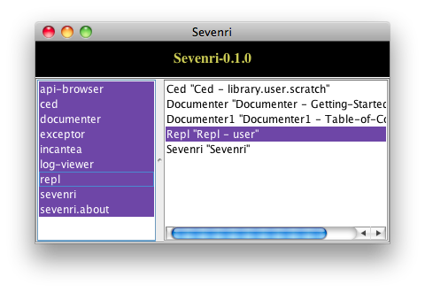
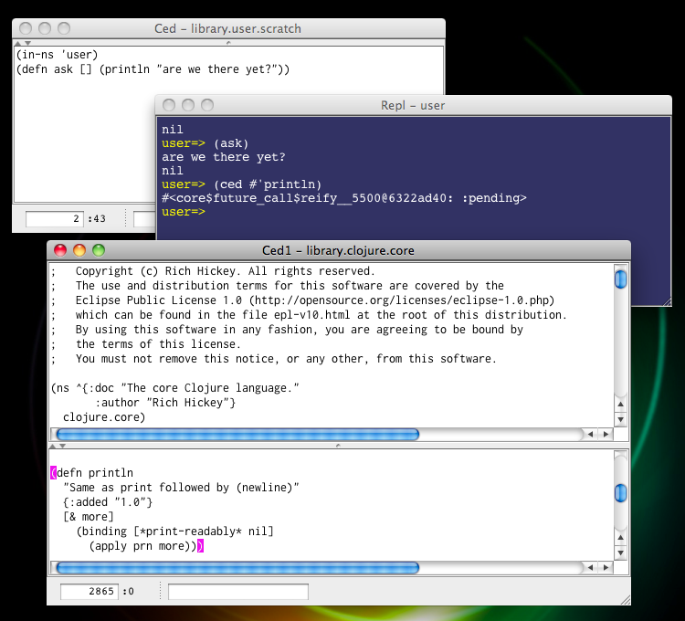
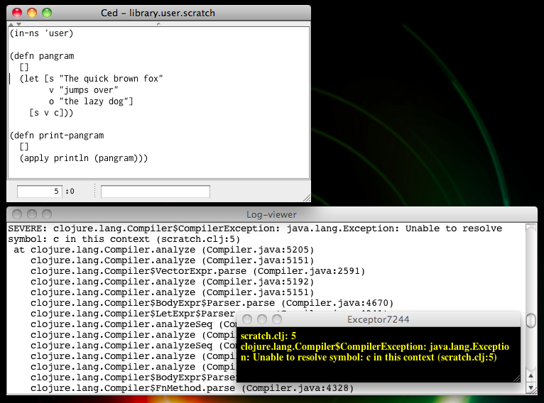

## 2 Getting Started

Currently Sevenri is tested on Mac OS X 10.6 (x86-64) only, and there are core functions and key bindings that assume the platform is Mac OS X.

In Sevenri most of the standard mouse actions and key bindings in Swing are available. Some of Sevenri key bindings use the META, ALT, and function keys. On Mac OS X the Command and Option keys are the META and ALT keys respectively, and depending on your keyboard you may need to hold down the Fn key when you press a function key unless you select the “Use all F1, F2, etc. keys as standard function keys” checkbox in Keyboard Preferences.

### 2.1 System Requirements

As of this writing

* Max OS X 10.6
* The Java VM used is Java HotSpot(TM) 64-Bit Server VM, version 17.1-b03-307, and Java version is 1.6.0_22.
* The versions of Clojure and contrib are both 1.2.0.
* `git` and `leiningen` commands

### 2.2 Setting Up Sevenri

In the following sections we call the directory where Sevenri repository resides *the Sevenri directory*. Path to Sevenri file is expressed relatively from the Sevenri directory, without the `.clj` extension unless needed. For example, `src/sevenri/core` means the file path *the-Sevenri-directory*`/src/sevenri/core.clj`.

Sevenri's source repository is on GitHub, [https://github.com/ksuzuki/Sevenri](https://github.com/ksuzuki/Sevenri). It is a leiningen project. Sevenri depends on leiningen to get required libraries. But it is not required to compile Sevenri to start it. The boot loader code is aot-compiled already and the rest of the code is compiled on-the-fly into JVM bytecode when loaded. Just download the Sevenri project and then run '`lein deps`' command in the Sevenri directory to download the dependencies. That is all you need to get ready to start Sevenri.

Here is an example; open Terminal and run the following commands.

		~$ git clone git://github.com/ksuzuki/Sevenri.git
		~$ cd Sevenri
		~$ lein deps

#### 2.2.1 Dependencies

This version of Sevenri depends on the following components.

* The Sevenri core system: [clojure](http://clojure.org/), [clojure-contrib](https://github.com/clojure/clojure-contrib), [swank-clojure](https://github.com/technomancy/swank-clojure/)
* UI components generated by NetBeans: [swing-layout](https://swing-layout.dev.java.net/)
* The slix `incantea`: [incanter-core, incanter-io, incanter-charts, incanter-processing, incanter-mongodb, incanter-pdf, incanter-latex, incanter-excel](http://incanter.org/) (please visit [here](https://github.com/liebke/incanter/wiki#depends) about Incanter dependencies)
* The slix `documenter`: [Mozilla Rhino](http://www.mozilla.org/rhino/)

### 2.3 Starting Sevenri

There are three ways to start Sevenri. In the Sevenri directory do one of the followings.

* Run this command from the command line.

	`java -Dfile.encoding=UTF-8 -cp src:lib/* Sevenri $* &>/dev/null &`

* Run the bash script `sevenri`, which runs the above command, from the command line.

	`sh ./sevenri`

* In the Finder go to the Sevenri directory and double-click `Sevenri.app`. It is an executable compiled from the AppleScript file `tools/Sevenri.scpt`, which runs the above command with your .bash_profile settings.

Normally drop `Sevenri.app` in the Dock and start Sevenri just by tapping it.

Note: your `Sevenri.app` file may not look like below in the Finder. If that is the case, see '2.10.4 Embedding the Sevenri Icon in Sevenri.app'.

#### 2.3.1 The .sevenri Directory and The Lock File

When Sevenri starts, it creates a directory named `.sevenri` (also called `sid` in the Sevenri code)  in the Sevenri directory. Sevenri saves bunch of files in the `sid` directory; aot-compiled slix files, log files, slix instance files, and temporary and trash files.

One file you should be aware of is the `lock` file in the directory `.sevenri/sevenri`. Sevenri creates it at startup and uses it to prevent multiple Sevenris starting from the same Sevenri directory. Sevenri removes the file when it quits. Remove the `lock` file manually if Sevenri crashed for some reason and failed to remove the file, or Sevenri won't start next time.

### 2.4 Slix and The Sevenri

A *slix* is an aggregate of libs providing definitions for particular Sevenri application. Each slix has a main lib whose namespace name consists of the prefix `"slix."` and the slix name. For example, the slix `sevenri` has the main lib `slix.sevenri`. Likewise, the slix `repl` has the main lib `slix.repl`.

A *slix instance* is a map that represents a slix as executable entity and contains values required to execute the slix functions. Each slix instance has a unique name and a JFrame as the main window of the slix instance.

When Sevenri starts, it opens one slix always; the Sevenri. The Sevenri is an instance of the slix `sevenri` and is special; it is a singleton slix and you cannot close it. The Sevenri has two panes; the left pane lists available slixes and the right pane lists slix instance names with its window title. Double-clicking a slix name in the left pane opens the slix, and the instance name will be shown in the right pane. For example, when you double-click 'repl' in the left pane, the Sevenri looks like this.

Selecting slix names in the left pane shows their instance names in the right pane. This is how the Sevenri looks after opening bunch of slixes and then selecting all slix names in the left pane.

Selecting a slix instance name in the right pane and then double-clicking it brings the instance window to the front.

### 2.5 REPL

The slix `repl` opens a window and runs the Clojure's read-eval-print loop, or REPL for short, in it. You can open multiple REPLs. By default the REPL starts in the *user* namespace. The prompt shows the current namespace and matching parentheses on the command line will be highlighted as you type. Also wherever the caret is it comes back on the command line when you start typing. You can open the on-line users manual at the REPL by calling the `open-sevenri-users-manual` funcion or its shorthand `open-sum`.

In the REPL window there are some `repl` specific key bindings available in addition to the standard key bindings. Such as:

* the up and down arrow keys scroll back and forth command history when the caret is on the command line
* META+] moves the caret to matching parenthesis position when parentheses are highlighted
* META+; moves the caret to the beginning of the command line

You can also open a new REPL using the `repl` macro. To end the REPL and close the window, click the red close (x) button in the top-left corner of the window or press META+W.

Among `repl` instances the one named "Repl" (normally the very first `repl` instance) is special. It saves the text in the window when it closes and restores the text when it opens next time. There is no limit set for the text size currently, so it keeps growing up. Eventually you would need to clear it. To do that call the `clear-repl-content` function or its shorthand macro `crc`.

When you are get caught in long running function or infinite loop, Use CTRL+C to interrupt it and get back to the prompt.

### 2.6 Ced

You can do quite a bit of stuff interactively at the REPL. But when you want to write fairly large function or edit lib and save them to file, you need a Clojure editor.

*Ced* is a slix designed to work best in the Sevenri environment for editing Clojure file and developing slix. Ced has the following features.

* Automatic indentation that is fairly close to the way Emacs in Clojure mode does
* Highlight matching parentheses
* Incremental search
* Undo/redo
* Split pane
* Hyperlink to Java API documentation
* Load and aot-compile Clojure file
* Open the slix currently editing

To open Ced, double-click 'ced' in the left pane of the Sevenri. Ced opens the default scratch file `src/library/user/scratch`. The `src/library/user` directory is where you save your work files mainly.

The user interface of Ced is very simple; it consists of the main text pane and a panel in the bottom. Notice the divider with the tiny arrows in the top edge area of the text pane. From left in the bottom panel there are the Line Number field, the Column Number field, and the Find field. There is also the modification indicator at the left most edge of the panel, which turns a red asterisk when you touch file and disappears when you save the file. The window title displays Ced instance name and the file name currently editing. When the mouse cursor is in the title area, hold down the ALT+META key. The full path name of the current file pops up. (Note: on Mac OS X the Option key is the ALT key.)

#### 2.6.1 Key Bindings and Edit Actions

In addition to the standard key bindings there are Ced specific key bindings such as:

* TAB and ENTER - automatic indentation
* META+] - move the caret to matching parenthesis position
* META+L - move the focus to the Line Number field
* META+F - move the focus to the Find field
* META+G - move the caret to the beginning of next match of the string in the Find field
* META+Z - undo edit action
* SHIFT+META+Z - redo undone action
* META+O - open a Clojure file
* META+S - save the file currently editing
* SHIFT+META+S - save the file currently editing in a different name

Normally the Line Number field displays the line number where the caret is on. But it is an editable field and you can go to line by specifying the line number in the field. Click in the field or press META+L, then specify the number and press ENTER. Pressing ESC or TAB cancels the operation and move the focus back to the text pane.

To find string, click in the Find field or press META+F and type the string you want to search for. Matching string, if any, will be highlighted as you type. Press ENTER or META+G to search next match. Keep pressing ENTER or META+G lets the search continue from the beginning of file. Press TAB to move the focus back to the text pane and then move the caret to the beginning of highlighting string. Press ESC to cancel search, move the focus back to the text pane and the caret moves back to original position. When the focus is in the text pane, pressing META+G moves the caret to the beginning of next match of the string in the Find field.

#### 2.6.2 Editing and Loading File: An Example

When you want to try out a Clojure code quickly, you would take the following steps in most cases.

1. Open REPL and Ced by double-clicking the names in the Sevenri. When you open Ced from the Sevenri, Ced opens the default scratch file.

2. In the Ced window type:  
  
	>(in-ns 'user)  
	>(defn ask [] (println "are we there yet?"))  
  
	Notice the modification indicator is on (displaying a red asterisk).

3. Press META+S to save the file. The red asterisk is now gone.

4. Then press F2. This lets Ced load the file so that the `ask` function will be defined in the `user` namespace.

5. Call the `ask` function at the REPL and see it prints the string.

#### 2.6.3 Opening and Saving File

To open Clojure file in Ced, press META+O and use the Open Sevenri File dialog box.

You can also open file in Ced at the REPL using the `ced` macro. The macro can take a file path or a java.io.File and optional line number as arguments.

File path can be either in symbol or string. When it's a symbol, it doesn't need to be quoted and period to slash and hypen to underscore translations are applied. Then a lib file corresponding the symbol in the `src` directory is looked up. Try the followings at the REPL. To open the default scratch file:

		(ced library.user.scratch)

To open the Sevenri's `slix` lib file and move to line 203:

		(ced sevenri.slix 203)

When you want to open a slix lib file you can abbreviate `slix`. For example, this opens the `core` file of the slix `repl`.

		(ced repl.core)

The symbol has to begin with `slix` only when you want to open a slix lib file whose name begins with `sevenri`. For example,

		(ced slix.sevenri.lists)

When the path is a string, it should be an absolute path or a relative path from the current Sevenri directory. When the argument is a java.io.File, it's taken as is. Either way you don't need to add the `.clj` extension. When the specified file doesn't exist or no argument is given, Ced falls back to open the default scratch file.

To save the file currently editing just press META+S. When you want to save file in different name, press SHIFT+META+S and use the Save As Sevenri File dialog box. You don't need to add `.clj` extension to the file name; Ced adds it for you. Also Ced applies the translations from period to slash and hyphen to underscore to file path when saving and does the other way around when opening.

#### 2.6.3 Browsing Libraries

You can also use Ced to browse libraries. For example, if you want to see how the `println` function is implemented, type this at the REPL.

>`(ced #'println)`

What happens then is that 1) the values under the `:file` and `:line` keys of the `println` var metadata are looked up, 2) figure out the location of the file `core.clj` based on the `:file` value and extract it from `clojure.jar`, 3) save the file to `src/library/clojure` directory, and 4) open Ced with the file path and the line number where the `println` function is defined.

### 2.7 The Log-viewer and Exceptor

The Clojure's `repl` function takes care of exception thrown in the REPL; it catches the exception and prints the summaries. The `repl` function of the slix `repl`, in turn, captures output data to the standard output and error streams and displays it in the REPL window, so you can see the exception message and summaries. For exceptions thrown outside of the REPL, Sevenri has a logging facility to catch it and save the messages to log file. Sevenri also captures output data written to the *System/out* and *System/err* streams and saves it to log file.

You can see the content of the current log file using the *Log-viewer*, an instance of the singleton slix `log-viewer`.

Whenever an exception is reported, the logging facility looks for the exception listeners registered to the logging facility and calls them with the exception object. Exceptor (the slix *`exceptor`*) is one slix using this feature. Given an exception object Exceptor does:

1. open a window in the bottom-right corner of the display and show the detail message of the exception in the window, and
2. when it is possible to figure out the location where the exception is thrown, open Ced with the location information.

Here is an example. Open Ced and write the code below exactly as shown:

		(in-ns 'user)

		(defn pangram
		  []
		  (let [s "The quick brown fox"
		        v "jumps over"
		        o "the lazy dog"]
		    [s v c]))

		(defn print-pangram
		  []
		  (apply println (pangram)))

For demonstration purpose, make sure to put the caret at the end of the last line. Now press F2 to load the file in the `user` namespace and then, oops! an Exceptor window is opened with a message. The message says there is a symbol that cannot be resolved at line 5. Click the Ced window and bring it to the font. Make sure to click in the window title, not the text pane, so that you can see the caret is set at the beginning of line 5 where the error message is pointing out as the error line. Open the Log-viewer and you can also see the stack trace of the exception is logged.

Exceptor can handle runtime exception similarly so that you can get to the point where it is OK syntactically but crashes when evaluated. Let's fix the syntax error and introduce a runtime error in the above code.

		(ns library.user.scratch)

		(defn pangram
		  []
		  (let [s "The quick brown fox"
		        v "jumps over"
		        o "the lazy dog"]
		    (s v o)))

		(defn print-pangram
		  []
		  (apply println (pangram)))

Notice the symbol 'c' is referenced correctly but a vector with 's', 'v', 'c' is turned into a list. Now the code doesn't have any syntax error but fails to return from the `pangram` function because 's' is not a function but a string. Notice also that the first line is changed so that the code is loaded as the lib `library.user.scratch`. It's because Exceptor handles runtime exception only when Sevenri lib is involved in the exception stack.

Load the lib by pressing F2. This time you don't get compiler exception. Then close the Ced, open the REPL, and call the `print-pangram` function like this:

> `(invoke-later #(library.user.scratch/print-pangram))`

What the heck is the `invoke-later` function and why is it used? Recall the Clojure's `repl` function takes care of exception, that is, exception thrown in the REPL will be caught and handled by the REPL so that the Sevenri's logging facility can't catch and hand it over to Exceptor. The `invoke-later` function is a Sevenri function that takes a body of expressions and post it to the event dispatch thread of the current slix instance. The body will then be evaluated later in a try-catch form which in turn calls a Sevenri's logging function if exception is thrown while evaluating the body.

This way you get two windows when you call the above function; one is an Exceptor window with the message pointing the error line and the other is a Ced window in that the file `library.user.scratch` is opened and the caret is set at the beginning of the error line.

Change the list in the line back to the vector to fix the error, and press F2. Then call the `invoke-later` function above again. This time it will print the pangram correctly (maybe after the next new prompt, and that is what is supposed to happen. You can continue typing as though nothing is there or press ENTER to get a new prompt).

#### 2.7.1 The Logging Functions and The lg Macro

The `log-info` function is one of the Sevenri's logging functions. It takes variable arguments and prints them to log file. Simply put, it is a `print-str` function printing to log file. The `lg` macro is a shorthand of the `log-info` function and is useful when debugging code.

Open the Log-viewer and try these at the REPL.

>`(log-info nil)`  
>`(lg 1 2 3)`  
>`(lg "Sevenri name:" (get-sevenri-name) "Sevenri version:" (get-sevenri-version))`  

### 2.8 API-browser

API-browser (the slix `api-browser`) searches an API document URL using a keyword and open the URL in the default system browser. It opens a small popup window for a very short time only when it didn't find URL in order to indicate the failure.

Currently API-browser accepts only a Java class or interface name as lookup keyword (letter case is ignored) and searches API document URL of Java SE 6 and EE 6.

You can call API-browser at the REPL using the `browse-api` macro or its shorthand `ba`. For example:

> `(browse-api jframe)`  
> `(ba string)`  
> `(ba element)`

In the last case you will get two document pages about `Element`; one is about `javax.xml.bind.Element` of Java SE 6 and the other is about `javax.lang.model.element.Element` of Java EE 6. Give a fully qualified class/interface name if you want to be specific and get just one page. For example:

> `(ba javax.xml.bind.Element)`

Also, when you want to use a nested class name, such as `HTML.Tag` of the `javax.swing.text.html` package, use '$' instead of '.' in the class name like `html$tag`.

Ced also knows how to call API-browser. For example, open Ced and type the following lines:

		(import '(javax.swing.text Segment)
		        'javax.swing.text.html.HTML$Tag)

Put the caret on "`Segment`" and press F1. Likewise, put the caret on "`javax.swing.text.html.HTML$Tag`" and press F1. You will get the document pages of `Segment` and `HTML$Tag` in the browser.

### 2.9 Quitting Sevenri

To quit Sevenri, press META+Q or choose Sevenri > Quit Sevenri from the Sevenri menu.

Sevenri remembers running slix instances when quitting and tries to open them at next startup. Slixes are given a chance to save instance data to file when closing and load it back when opening. So, for example, when you quit Opener while the Sevenri and the Repl are running, you will see them reappear at the same location when Sevenri starts next time.

### 2.10 Tips

#### 2.10.1 Global Keyboard Shortcuts

* META+W: most of slixes accept META+W as the window close action.

* META+\`: by default META+\` (the "backquote" key) is taken by Mac OS X and it brings next *visible* window to the font *immediately*. But any minimized windows are ignored. When you disable the keyboard shortcut "Move focus to next window in application" in Keyboard Preferences, Sevenri takes over the key and behaves differently. In stead of bringing up next visible window to the front immediately, a small popup window shows up in next window's top-left corner with the window's title. Even if next window is minimized, the popup window still appears as though the window is visible at the location. Release the key when you find the window you are looking for, then the window comes to the font, restoring it if it was minimized. Press SHIFT+META+\` to move on backward and META+ESC to cancel the operation and stay with the current window.

#### 2.10.2 The Trash Directory

Most of slixes are designed to move old copy of file into the directory `.sevenri/trash` before updating or deleting the file so that you may be able to retrieve most recently updated/deleted file from there.

#### 2.10.3 UTF-8 File Encoding

Sevenri uses UTF-8 as file encoding.

#### 2.10.4 Embedding the Sevenri Icon in Sevenri.app

Your `Sevenri.app` file may not look like this in the Finder.

You can embed the Sevenri icon in your `Sevenri.app` file and make it look like above.

1. In the Finder go to the `tools` directory and open the file `Sevenri-icon.icns` to see the Sevenri icons in Preview.

2. In Preview choose Edit > Select All and then Edit > Copy.

3. Go back to the Finder and select `Sevenri.app`. Then choose File > Get Info.

4. At the top of the `Sevenri.app` Info window, click the picture of the icon to select it, and then choose Edit > Paste.
