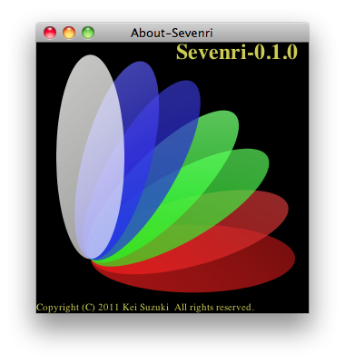

## 3.8 About-Sevenri

slix name: `sevenri.about`

About-Sevenri is a tiny slix that displays the version number, icon, and copyright notice of Sevenri. Also saves the icon image to file. Hold down the META key and click in the window. The icon image in the PNG format is saved in the directory `.sevenri/temp`.

