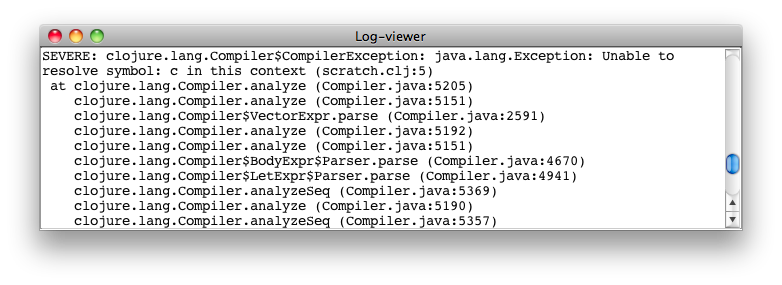

## 3.6 Log-viewer

slix name: `log-viewer`

Log-viewer is a singleton slix and the instance is called the Log-viewer. The Log-viewer displays the content of the current log file, updating it every one second.

Sevenri opens a new log file at startup. Up to four most recent log files are saved. Messages printed from the Sevenri's logging functions are saved to log file. Sevenri also captures output data written to *System/out* and *System/err* streams and saves it to log file.
